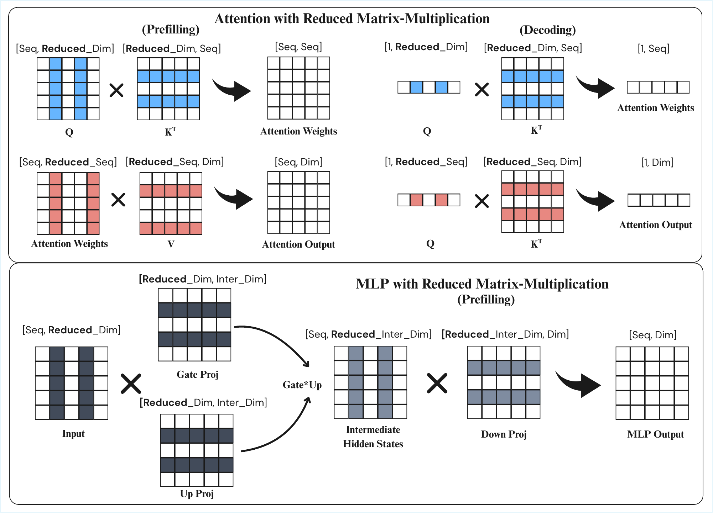

# RMM: Reduced Matrix Multiplication for Input-Adaptive LLM Inference

Training-free, input-adaptive reduction of Transformer matrix multiplications
for language and multimodal model inference.

**Zixuan Lan**<br>
University of Chicago · [zixuanlan@uchicago.edu](mailto:zixuanlan@uchicago.edu)

**Yanhong Li**<br>
Independent Researcher · Email forthcoming

**Jiawei Zhou**<br>
Stony Brook University · [jiawei.zhou.1@stonybrook.edu](mailto:jiawei.zhou.1@stonybrook.edu)



*RMM selects informative slices along matrix contraction dimensions for
Attention and MLP computation. The original vector figure is available as
[method.pdf](method.pdf).*

## Abstract

Transformer-based language models achieve strong performance but incur
substantial inference cost due to repeated high-dimensional matrix
multiplications. We propose **Reduced Matrix Multiplication (RMM)**, a
training-free, input-adaptive inference method that reduces Transformer matrix
products by selecting informative slices along their contraction dimensions,
without modifying model weights. Under a simple retention-ratio control, RMM
provides a smooth and predictable accuracy-efficiency trade-off. Across
language models ranging from 1B to 70B parameters, we show that larger models
tolerate more aggressive reduction, and that RMM remains stable across
discriminative evaluation, autoregressive generation, and long-context
reasoning. We further show that the same principle extends to multimodal
vision-language inference. Mechanistic ablations reveal a structural asymmetry
within Transformers: attention-side computations are substantially more
reducible than MLP components. Finally, wall-clock benchmarks with custom
kernels on an NVIDIA A100 show that these computational savings can translate
into practical runtime gains, especially at longer sequence lengths. Together,
these results position RMM as a scalable direction for input-adaptive
inference-time optimization.

## Method

RMM reduces a matrix multiplication by ranking the current activation along
its contraction dimension, retaining the most informative slices, and applying
the same indices to the corresponding weight or activation operand. It is:

- **Training-free:** no fine-tuning or calibration set is required.
- **Input-adaptive:** retained dimensions are selected from each input at
  inference time.
- **Weight-preserving:** pretrained model weights are not modified.
- **Controllable:** one retention ratio determines how much computation is
  retained.

This release exposes the three reduction locations studied in the paper:

- `attention`: Q/K feature selection followed by attention-column/V-token
  selection.
- `qkv`: input-column selection for `q_proj`, `k_proj`, and `v_proj`.
- `mlp`: input-column selection for `gate_proj`, `up_proj`, and `down_proj`.

The implementation is a correctness-first PyTorch reference. CUDA/Triton
kernel prototypes are not included in this initial release, and the reference
implementation does not claim wall-clock speedup by itself. The current code
release focuses on the language-model experiments; multimodal evaluation code
is not included yet.

## Installation

```bash
git clone https://github.com/Zesearch/rmm-llm.git
cd rmm-llm
python -m venv .venv
source .venv/bin/activate
pip install -e ".[eval,dev]"
```

Install all optional evaluation and quantization dependencies with:

```bash
pip install -e ".[eval,quant,harness,summarization,dev]"
```

## Dense RMM evaluation

Evaluate Attention, QKV, and MLP reduction through one entry point:

```bash
python scripts/evaluate_dense.py \
  --model /path/to/Llama-3.1-8B \
  --methods attention qkv mlp \
  --keep-ratios 1.0 0.8 0.5 \
  --tasks copa piqa \
  --max-samples 20 \
  --local-files-only
```

The `1.0` setting is the unreduced baseline. QKV and MLP reduction currently
expect ordinary floating-point `torch.nn.Linear` modules.

The projection API can also be used directly:

```python
from rmm import projection_pruning

with projection_pruning(model, targets=["qkv"], keep_ratio=0.8):
    outputs = model(**inputs)

with projection_pruning(model, targets=["mlp"], keep_ratio=0.8):
    outputs = model(**inputs)
```

## Attention RMM with quantized weights

Quantization compatibility is evaluated on the Attention RMM path. It does not
wrap bitsandbytes QKV/MLP weight containers.

```bash
python scripts/evaluate_quant.py \
  --model /path/to/Llama-3.1-8B \
  --quantization none bnb-int8 bnb-nf4 \
  --keep-ratios 1.0 0.8 0.5 \
  --tasks copa piqa \
  --max-samples 20
```

Supported loading modes are dense, prequantized checkpoints, bitsandbytes INT8,
NF4, and FP4. RMM acts on attention activations produced by the loaded model;
this is not a fused quantized RMM kernel.

## Evaluation scripts

- `scripts/evaluate_dense.py`: native multiple-choice evaluation for the three
  paper reduction locations.
- `scripts/evaluate_quant.py`: Attention RMM and weight-quantization
  compatibility.
- `scripts/evaluate_lm_eval.py`: `lm-evaluation-harness` tasks, including MMLU,
  GSM8K, HumanEval, and RULER configurations.
- `scripts/evaluate_perplexity.py`: strided sliding-window perplexity.
- `scripts/generate_summaries.py`: summarization generation.
- `scripts/score_summaries.py`: ROUGE, chrF, and BERTScore evaluation.

HumanEval can execute generated code and requires the explicit
`--confirm-run-unsafe-code` flag. Run it only in an appropriate sandbox.

## Supported model adapters

The eager-Attention adapter currently recognizes Llama, Qwen2, Qwen3, Mistral,
Gemma, and Gemma 2 model modules. Llama and Qwen3 are the historically tested
families; other adapters should be smoke-tested with the exact Transformers
release used for evaluation. Flash Attention and SDPA bypass this reference
adapter, so load models with `attn_implementation="eager"`.

## Repository layout

```text
src/rmm/                 RMM implementations and Hugging Face adapters
scripts/                 Evaluation and compatibility entry points
tests/                   Correctness and configuration tests
docs/                    Reproduction and baseline policy
method.pdf               Vector version of the method figure
method.png               README-renderable method figure
```

## Reproducibility

Record the exact model revision, Transformers version, CUDA version, GPU,
dataset revision, context length, and retention ratio for every run. Begin with
a small `--max-samples` smoke test before launching the full evaluation.

External baselines such as H2O should be run from their official repositories;
their implementations are not vendored here. See
[`docs/BASELINE_POLICY.md`](docs/BASELINE_POLICY.md) for the comparison policy.

## Citation

The paper link and BibTeX entry will be added upon release.

## License

This project is released under the Apache License 2.0. See
[`LICENSE`](LICENSE) for details.
